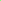

<div align="center">

# DesignShip

**Design it. Ship it. The tool that connects the two.**

Zero-input communication layer that turns your GitHub + Figma activity into standups, release notes, and stakeholder updates.

[](LICENSE)
[](https://tanstack.com/start)
[]()



</div>

## Table of Contents

- [Features](#features)
- [Tech Stack](#tech-stack)
- [Quick Start](#quick-start)
- [Environment Variables](#environment-variables)
- [Development](#development)
- [Architecture](#architecture)
- [Deployment](#deployment)
- [Contributing](#contributing)
- [License](#license)

## Features

### Core

- Authenticate via GitHub OAuth and browse connected repositories
- View merged PRs in a chronological timeline with metadata badges
- Select any repo to filter the timeline feed
- Toggle between Builder and Stakeholder views per audience
- Generate weekly summaries and browse or export from history

### Integrations

- Connect Figma via OAuth from the settings page
- Display Figma design screenshots inline when PRs reference links
- Fetch repositories, PRs, and commits via GitHub REST API

### AI-powered

- Rewrite technical PR descriptions into plain English with Claude
- Generate structured weekly reports: Shipped, In Progress, Decisions
- Classify timeline events by feature area automatically

### Polish

- Switch dark and light themes with system preference detection
- Adapt layout responsively across mobile, tablet, and desktop
- Show skeleton loaders, error boundaries, and toast notifications
- Detect offline status and display a network indicator

## Tech Stack

| Layer | Technology | Purpose |
|-------|-----------|---------|
| Framework | TanStack Start | Client-side focused React framework |
| Build Tool | Vinxi (v0.5+) | Server framework used by TanStack Start |
| Runtime | React 19 | UI library |
| Language | TypeScript | Type-safe JavaScript |
| Routing | TanStack Router | File-based routing with type safety |
| Styling | Tailwind CSS v4 | Utility-first CSS (CSS-native config via @tailwindcss/vite) |
| Components | shadcn/ui + Studio Pro | Premium component library |
| Database | Supabase | Postgres + Auth + Realtime |
| AI | Claude API (sonnet-4) | Summarisation, technical → plain English |
| Integrations | GitHub REST API | OAuth + PR/commit data |
| Integrations | Figma REST API | Design screenshots |
| Deployment | Vercel | TanStack Start Vercel preset |
| Auth | Supabase Auth | GitHub OAuth (connects repos too) |

Server-only secrets (`ANTHROPIC_API_KEY`, `FIGMA_CLIENT_SECRET`) are accessed via TanStack server functions and never exposed to the client bundle.

## Quick Start

**Prerequisites:** Node.js 20+, npm or pnpm, a [Supabase](https://supabase.com) project, a [GitHub OAuth App](https://docs.github.com/en/apps/oauth-apps/building-oauth-apps/creating-an-oauth-app) configured in Supabase Auth, an [Anthropic API key](https://console.anthropic.com), and optionally a [Figma OAuth App](https://www.figma.com/developers/apps).

```bash
git clone <repo-url>
cd designship
cp .env.example .env   # fill in your Supabase, Anthropic, and (optional) Figma credentials
npm install
npm run dev
```

Open [http://localhost:3000](http://localhost:3000) to start.

> The live deployment URL will be added once Vercel deployment is complete.

## Environment Variables

Copy `.env.example` to `.env` and fill in the values. The table below describes each variable.

| Variable | Required | Scope | Description |
|----------|----------|-------|-------------|
| `VITE_SUPABASE_URL` | Yes | Client | Supabase project URL (`https://<ref>.supabase.co`) |
| `VITE_SUPABASE_ANON_KEY` | Yes | Client | Supabase anonymous (public) API key |
| `ANTHROPIC_API_KEY` | Yes | Server | Anthropic API key for Claude-powered AI features |
| `VITE_FIGMA_CLIENT_ID` | No | Client | Figma OAuth app client ID (enables Figma integration UI) |
| `FIGMA_CLIENT_ID` | No | Server | Figma OAuth app client ID (used in server-side token exchange) |
| `FIGMA_CLIENT_SECRET` | No | Server | Figma OAuth app secret (used in server-side token exchange) |
| `SITE_URL` | No | Server | Base URL for OAuth redirect URIs (defaults to `http://localhost:3000`) |
| `EMAIL` | No | Build | shadcn Studio Pro license email |
| `LICENSE_KEY` | No | Build | shadcn Studio Pro license key |

> **Security:** Server-only variables must **not** be prefixed with `VITE_`. The `VITE_` prefix tells Vite to bundle the value into the client JavaScript, which would expose secrets to the browser. Only `VITE_SUPABASE_URL`, `VITE_SUPABASE_ANON_KEY`, and `VITE_FIGMA_CLIENT_ID` are safe to expose — they are public by design.

## Development

| Command | Description | When to use |
|---------|-------------|-------------|
| `npm run dev` | Start the Vinxi dev server with HMR | Day-to-day development |
| `npm run build` | Production build via Vinxi | Before deploying or testing the production bundle locally |
| `npm run start` | Serve the production build | Verify the built app works before pushing to Vercel |
| `npm run lint` | Run `tsc --noEmit` for type checking | Before committing — catches type errors without emitting files |

The dev server runs at [http://localhost:3000](http://localhost:3000) by default. Hot module replacement is handled by Vite under the hood (via Vinxi).

## Architecture

### Route structure

Routes use TanStack Router's file-based convention inside `app/routes/`:

```
app/routes/
├── __root.tsx              ← Root layout (AuthProvider, ThemeProvider, QueryClient)
├── login.tsx               ← GitHub OAuth login page
├── auth/callback.tsx       ← Supabase auth callback
├── auth/figma-callback.tsx ← Figma OAuth callback
├── _authenticated.tsx      ← Auth guard layout (redirects to /login if unauthenticated)
└── _authenticated/
    ├── index.tsx           ← Main timeline (/)
    ├── summaries.tsx       ← Summary history (/summaries)
    └── settings.tsx        ← Connected accounts (/settings)
```

The `_authenticated` prefix is a TanStack Router layout route — all children require a valid Supabase session.

### Library modules (`src/lib/`)

| Module | Purpose |
|--------|---------|
| `supabase.ts` | Supabase client, lazily initialized via a JS Proxy to avoid accessing `import.meta.env` during server-side module evaluation |
| `auth.tsx` | Auth context and provider wrapping Supabase Auth |
| `github.ts` | GitHub REST API client for repos, PRs, and commits |
| `figma.ts` | Figma REST API client + server function for OAuth token exchange |
| `ai.ts` | Claude API integration — `callClaude` helper plus server functions for rewriting, classifying, and summarising |
| `summaries.ts` | Summary CRUD operations against Supabase |
| `format-summary.ts` | Text and Markdown export formatters |
| `utils.ts` | `cn()` helper (clsx + tailwind-merge) |

### Hooks (`src/hooks/`)

| Hook | Purpose |
|------|---------|
| `use-github.ts` | Fetch repos and paginated merged PRs via React Query |
| `use-figma.ts` | Fetch Figma design screenshots for timeline entries |
| `use-ai-rewrite.ts` | Batch-rewrite PR descriptions into plain English (stakeholder view) |
| `use-ai-classify.ts` | Classify timeline events by feature area |
| `use-weekly-summary.ts` | Generate weekly summaries via Claude |
| `use-summaries.ts` | Summary CRUD operations via React Query |
| `use-theme.ts` | Dark/light theme with system preference detection |
| `use-mobile.ts` | Responsive breakpoint detection |
| `use-copy-summary.ts` | Copy summary text to clipboard |

### Server functions

Server-side logic uses `createServerFn` from `@tanstack/start-client-core`. These functions run on the server during SSR and as API endpoints from the client. They are used for:

- **Claude API calls** (`src/lib/ai.ts`) — `rewriteOnServer`, `classifyOnServer`, `generateSummaryOnServer`, all routed through a shared `callClaude(prompt, maxTokens)` helper
- **Figma token exchange** (`src/lib/figma.ts`) — exchanges the OAuth code for an access token server-side

All server functions validate input with `.inputValidator()` and authenticate the caller via `verifyAuth(accessToken)` before processing.

### Conventions

- **Supabase lazy proxy:** The client in `src/lib/supabase.ts` uses a JS `Proxy` for lazy initialization, avoiding `import.meta.env` access during server-side module evaluation. Use it like `supabase.auth.getUser()`.
- **localStorage keys:** All keys use the `ds-` prefix — `ds-github-token`, `ds-figma-token`, `ds-theme`, `ds-view-mode`, `ds-ai-cache:*`, and `ds-figma-oauth-state` (sessionStorage).

## Deployment

DesignShip deploys to [Vercel](https://vercel.com) using the TanStack Start preset. The repo includes a `vercel.json` that sets `framework: null` and `outputDirectory: .output`, and `app.config.ts` configures `server: { preset: 'vercel' }` — no manual build configuration is needed.

### 1. Install the Vercel CLI

```bash
npm i -g vercel
```

### 2. Authenticate

```bash
vercel login
```

### 3. Link the project

```bash
vercel link
```

When prompted, create a new project named `designship` with the code directory set to `./`.

### 4. Add environment variables

Add each variable from `.env.example` scoped to Production, Preview, and Development:

```bash
vercel env add VITE_SUPABASE_URL
vercel env add VITE_SUPABASE_ANON_KEY
vercel env add ANTHROPIC_API_KEY
vercel env add VITE_FIGMA_CLIENT_ID
vercel env add FIGMA_CLIENT_ID
vercel env add FIGMA_CLIENT_SECRET
vercel env add SITE_URL
```

For `SITE_URL`, use `https://designship.vercel.app` for Production, `https://$VERCEL_URL` for Preview, and `http://localhost:3000` for Development.

### 5. Deploy to production

```bash
vercel --prod
```

### Post-deploy: update OAuth callback URLs

After your first production deploy, update the callback URLs in these services:

- **Supabase** (Authentication → URL Configuration → Redirect URLs):
  - `https://<your-domain>/auth/callback`
  - `https://<your-domain>/auth/figma-callback`
- **GitHub OAuth App** (Settings → Developer settings → OAuth Apps):
  - Homepage URL → your production domain
- **Figma Developer App** (Callback URL):
  - `https://<your-domain>/auth/figma-callback`

## Contributing

PRs are welcome! Before opening one:

1. Run `npm run lint` to catch type errors
2. Follow [Conventional Commits](https://www.conventionalcommits.org/) for your commit messages (e.g. `feat:`, `fix:`, `docs:`)
3. Keep PRs focused — one feature or fix per PR

## License

[MIT](LICENSE)
